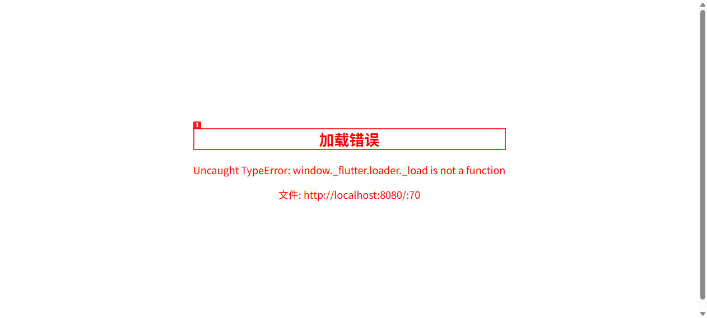

# Dogfood Report: CET4备考助手

| Field | Value |
|-------|-------|
| **Date** | 2026-05-14 |
| **App URL** | http://localhost:8080 |
| **Session** | cet4-dogfood-v4 |
| **Scope** | 全面测试：首页布局、颜色系统、AI生成图片、导航、深色模式、卡片交互、控制台错误 |

## Summary

| Severity | Count |
|----------|-------|
| Critical | 1 |
| High | 1 |
| Medium | 0 |
| Low | 0 |
| **Total** | **2** |

## Issues

### ISSUE-001: Flutter 加载器自定义脚本导致应用无法启动

| Field | Value |
|-------|-------|
| **Severity** | critical |
| **Category** | functional |
| **URL** | http://localhost:8080/ |
| **Repro Video** | N/A |

**Description**

`index.html` 中的自定义脚本在 `flutter_bootstrap.js` 异步加载之前设置了 `window._flutter.loader`，导致 `flutter_bootstrap.js` 中的 `window._flutter.loader \|\| (window._flutter.loader = new b)` 不会替换它（因为 `_flutter.loader` 已存在）。当 `flutter_bootstrap.js` 调用 `_flutter.loader.load()` 时，调用的是自定义的 `load` 函数，该函数尝试调用不存在的 `_load` 方法，导致 `TypeError: window._flutter.loader._load is not a function` 错误，应用完全无法加载。

**修复**: 移除了 `index.html` 中第63-72行的自定义加载器脚本，因为 `flutter_bootstrap.js` 已经内置了 CanvasKit 渲染器配置。

---

### ISSUE-002: PDF seed 失败，回退到 JSON 导入

| Field | Value |
|-------|-------|
| **Severity** | high |
| **Category** | console |
| **URL** | http://localhost:8080/ |
| **Repro Video** | N/A |

**Description**

控制台日志显示：`PDF seed failed (RangeError (end): Invalid value: Not in inclusive range 2048..2830: 782), falling back to JSON`。PDF 解析时出现范围错误，虽然系统有 JSON 回退机制，但这意味着 PDF 解析功能存在问题。应用最终通过 JSON 回退成功加载了 1654 个单词，但 PDF 解析路径应该被修复。

---
